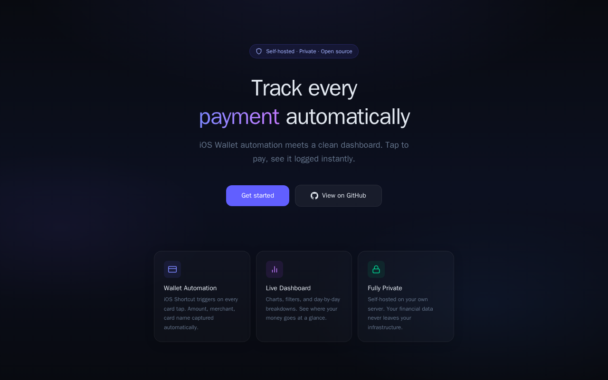

# Payment Tracker

A self-hosted payment tracking app with AES-256-GCM encryption. Accepts transactions from Apple Wallet via iOS Shortcuts and displays them in a glassmorphic dashboard.




**Stack:** Bun, Hono, Drizzle ORM, PostgreSQL, SvelteKit, Tailwind CSS

**Currency:** PLN (Polish zloty) — hardcoded in formatting

## Quick Start

```bash
bun install
cp .env.example .env

# Start PostgreSQL
docker compose up db -d

# Push database schema
cd packages/api && bun run db:push && cd ..

# Start API + frontend
bun run dev
```

API runs on http://localhost:3010, frontend on http://localhost:5173.

## Docker Deployment

```bash
cp .env.example .env
docker compose up -d
```

Database migrations run automatically on API startup. PostgreSQL data persists in the `pgdata` Docker volume.

API: port 3010, Frontend: port 3011, PostgreSQL: port 5432.

## Apple Shortcut Setup

### Option A: iCloud Link (recommended)

1. Open the **/setup** page on your iPhone
2. Tap **Add to Shortcuts**
3. Paste your **API URL** and **API Token** when prompted (shown on the setup page)
4. Go to **Automation** tab → **New Automation** → **Transaction** → select your card(s) → run the shortcut

To configure: create the shortcut manually (see Option B), add Import Questions for API URL and Token, share via iCloud, and set `ICLOUD_SHORTCUT_URL` in your `.env`.

### Option B: Manual Setup

1. Open the **Shortcuts** app and tap **+** to create a new shortcut
2. Add a **Dictionary** action with keys:
   - `amount` → Amount (Wallet variable)
   - `seller` → Merchant (Wallet variable)
   - `card` → Card (Wallet variable)
3. Add **Get Contents of URL** action:
   - URL: your endpoint (shown on /setup page)
   - Method: **POST**
   - Headers: `Authorization: Bearer <your-token>`, `Content-Type: application/json`
   - Body: **Dictionary** from step 2
4. (Optional) Add **Show Notification** to confirm the payment was logged
5. Go to **Automation** tab → **New Automation** → **Transaction** → select your card(s) → run the shortcut

## Exporting Data

Export from the **Export** page in the dashboard, or via API:

```bash
curl -H "Authorization: Bearer <token>" \
  "https://your-domain/api/transactions/export?format=csv"
```

Supports `?format=csv|json`, `?from`, `?to` date filters.

## Webhooks

Notify external services on transaction events. Manage from the **Webhooks** page.

1. Add a webhook URL and select events (`transaction.created`, `transaction.deleted`)
2. Optionally add a secret for HMAC-SHA256 signature verification (`X-Webhook-Signature` header)

## Encryption

Transaction fields (`amount`, `seller`, `card`, `title`) are encrypted at rest using AES-256-GCM with per-user keys. Keys are auto-generated at signup and stored in the database. Encryption is transparent — data is encrypted on write and decrypted on read.

**Note:** Encryption keys are stored alongside encrypted data. This protects against offline database access (stolen backups) but not full server compromise.

## API Endpoints

All endpoints require `Authorization: Bearer <token>` header.

| Method | Path | Description |
|--------|------|-------------|
| POST | `/api/transactions` | Create transaction |
| GET | `/api/transactions` | List transactions (?limit, ?offset, ?from, ?to) |
| GET | `/api/transactions/stats` | Summary statistics (?from, ?to) |
| GET | `/api/transactions/export` | Export transactions (?format=csv\|json, ?from, ?to) |
| DELETE | `/api/transactions/:id` | Delete transaction |
| GET | `/api/webhooks` | List webhooks |
| POST | `/api/webhooks` | Create webhook |
| PATCH | `/api/webhooks/:id` | Toggle webhook (active/inactive) |
| DELETE | `/api/webhooks/:id` | Delete webhook |
| GET | `/health` | Health check (no auth) |
